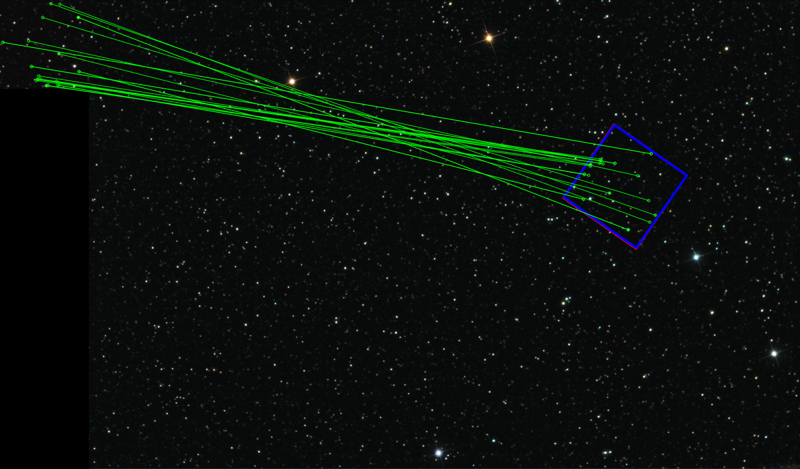
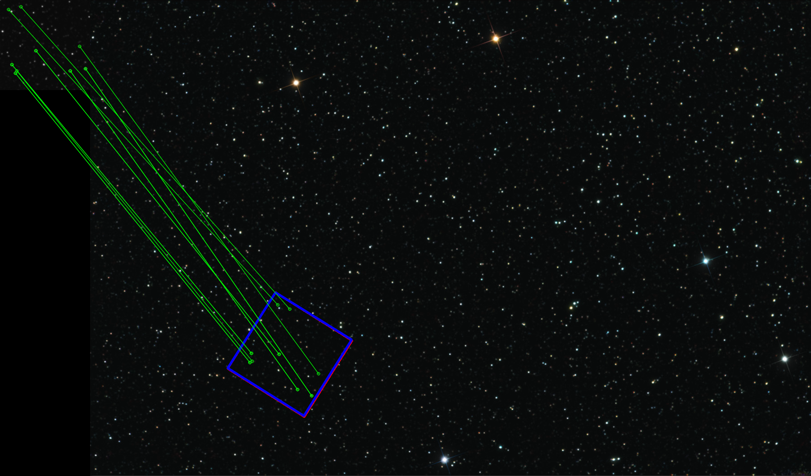
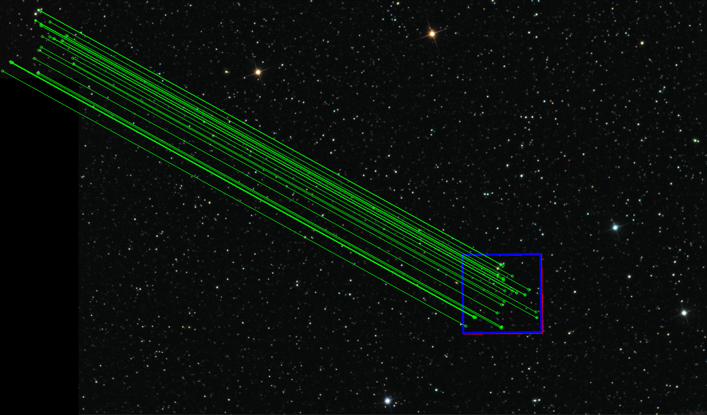

# OpenCV Feature Matching 

## Examples





## Usage
## Via Docker Compose
Build the image and run the container:

```sh
$ docker-compose up -d --build
```

### With your own environment
```shell
pip install -r requirements.txt
```

To use with existing images
```shell
python main.py --base_image_path=images/StarMap.png --sub_image_path=images/Small_area.png
```
Generate random sub images from base and predict their coordinates
```shell
python main.py --base_image_path=images/StarMap.png --random_flag=True
```
